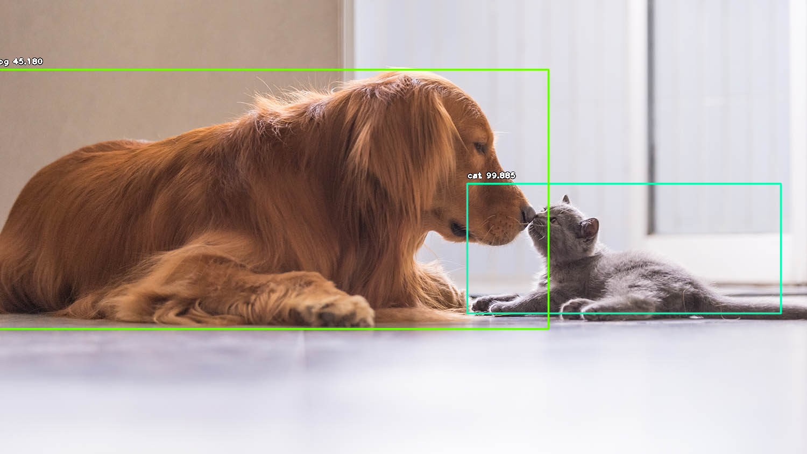

# Dogspotting
Use machine learning for computer vision to draw bounding boxes around dogs in pictures. [See accompanying blog post.](https://www.rileynwong.com/blog/2019/3/5/dogspotting-using-machine-learning-to-draw-bounding-boxes-around-dogs-in-pictures)

NBViewer for easier viewing (recommended) [here](https://nbviewer.jupyter.org/github/rileynwong/dogspotting/blob/master/Image_detection.ipynb) 

## Setup 

1. (Optional) Create Anaconda environment w/ Python 3.6: `$ conda create -n retinanet python=3.6 anaconda`

2. (Optional) Activate virtual environment: `$ source activate retinanet`

3. Install dependencies: `$ conda install tensorflow numpy scipy opencv pillow matplotlib h5py keras`

4. Install ImageAI library: `$ pip install https://github.com/OlafenwaMoses/ImageAI/releases/download/2.0.1/imageai-2.0.1-py3-none-any.whl`

5. Download pretrained RetinaNet model: https://github.com/OlafenwaMoses/ImageAI/releases/download/1.0/resnet50_coco_best_v2.0.1.h5

## Files
- `Image_detection.ipynb`: Jupyter notebook, walks through the steps and set up
- `detect_single_image.py`: Script to run to run object detection on a single image file. Set `input_path` to your image file.
- `detect_images_folder.py`: Script to run to run object detection on images in a folder. Set `input_images_path` to `your-folder/*`. Resulting images can be found in `results/` directory. Keep in mind that the `results` folder images will be overwritten each time you run the script, so move previous files elsewhere. 

## Credits
- [ImageAI library](https://github.com/OlafenwaMoses/ImageAI)
- [Object detection tutorial](https://www.analyticsvidhya.com/blog/2018/06/understanding-building-object-detection-model-python/)
